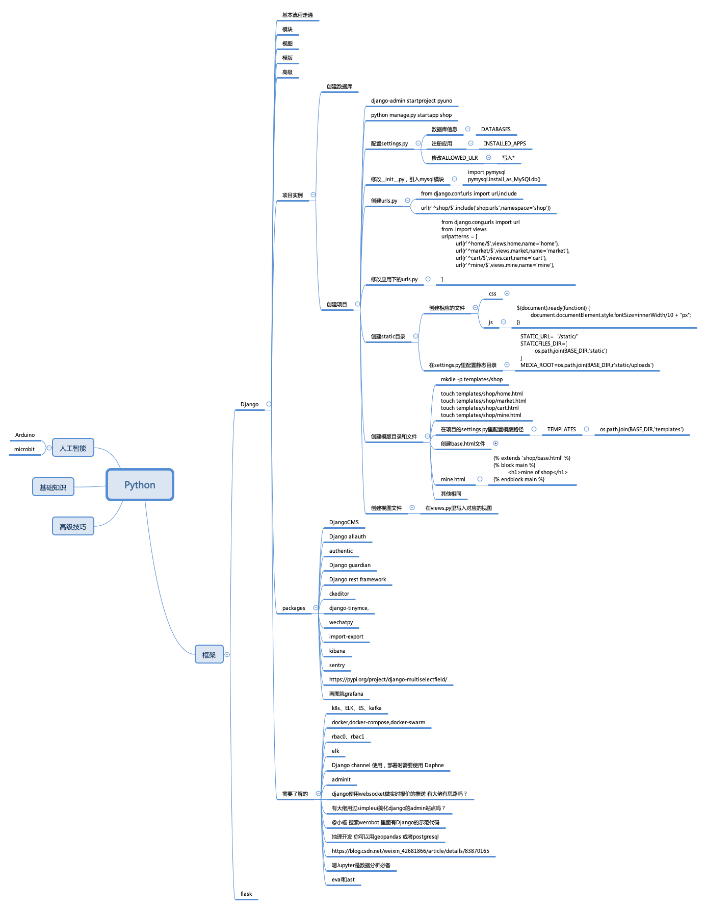

# 前言

如同大多数人一样，在前些年，Python开始火热起来的时候我也开始学习了Django，当时并没有什么特别的设想，只是想学习一门新的开发语言。随着不断的学习，一步一步的深入，对这门语言是越来越喜欢了。最初入门时，通过在B站上的教程视频，几百小时的视频教程不停的看了两遍，一边看一边还做脑图。

再后来，入门之后就开始帮朋友做了一个应用，现在回看，代码太稚嫩了，以至于后来不断的完善和修复。在做第一个应用时候在Github写了第一版的学习笔记，总结了当时所有操作的步骤。也就是在那一版笔记的基础上才有了现在这里这些总结。

第一版笔记，基于Python-2.6、Django-1.11、DjangoCMS-3.5.4，前端的Themes是[clean-blog](https://startbootstrap.com/themes/clean-blog/)，当时还自定义了一个类admin界面，使用了[startbootstrap-sb-admin-2-gh-pages](https://startbootstrap.com/template-categories/all/) 。

一转眼三四年已经过去，当时Django1.11已经老旧，而且Python2都已经走向末路，在此次升级的机会，重新整理的当时的笔记，尽量修复当时的错误理解

在这次重新整理中，开始使用Django-3.1，DjangoCMS-3.7，其他对应的packages也相应的进行了升级，所以在行文中，如果有旧版本的遗漏，烦请指正，谢谢。

与其他不同的是，我所有的笔记内容都是基于DjangoCMS的，并没有直接基于Django。这也是我在学习过程中发现DjangoCMS是一款优秀的基于Django的内容管理系统，可以不需要太多编程就实现站点的建设，甚至足以满足一个企业级的内容管理需求。而且DjangoCMS提供的Admin界面更加细腻，不需要再使用Xadmin等等。所以对于初级学习是非常便捷的，既是是学习Django也没有增加太多的困难，所以从**可使用**的角度看，直接从DjangoCMS入手，是一条实践的捷径。

一般来说，官方文档是最好的教程，这里贴出官方文档地址([Django](https://docs.djangoproject.com/zh-hans/3.1/),[DjangoCMS](http://docs.django-cms.org/en/latest/))，以供查阅。

开发工具：推荐VSCode，当然很多人用Pycharm，需要找破解码，嫌弃它需要破解浪费时间，直接用VScode，好用，香。

强烈建议：

1. 官方文档不能不看，一定要看！
2. 遇到问题，找搜索引擎，搜索结果中：CSDN太乱，JianShu、juejin的可以看
3. 遇到问题，看看Github
4. 某娘的搜索结果不能相信，十个结果也不一定找到一篇有帮助的

学习笔记很多内容来自于网络，我尽量的记录的当时的地址，时间久远，有些原文地址已经不记得了，在此特别声明并感谢，未能标记来源请见谅。

我学习Django的后期主要参考了大江狗的微信公众号，关于Django的内容质量还是很高的，我本人也向大江狗本人申请了授权，部分内容会转载大江狗的微信文章内容，尤其是关于Django-Rest-Framework的内容，非常值得推荐，我打算在那一章节完全转载大江狗的文章，再次感谢大江狗\[新博客地址：[pythondjango.cn](https://pythondjango.cn)]。

下面是Django的版本和Pythpn的版本对应关系，仅供参考。

| Django Versions | Python Versions     | Remarks |
| --------------- | ------------------- | :-----: |
| 1.8             | 2.7,3.2,3.3,3.4,3.5 |         |
| 1.9,1.10        | 2.7,3.4,3.5         |         |
| 1.11            | 2.7,3.4,3.5         |         |
| 2.0             | 3.4,3.5,3.6         |         |
| 2.1             | 3.5,3.6,3.7         |         |
| 2.2             |                     |         |
| 3.0             |                     |         |
| 3.1             |                     |         |

DjangoCMS与Django、Python版本对应关系

| django CMS | Python |     |     |     |     |     |     |     | Django |     |     |     |      |      |     |     |     |     |
| ---------- | ------ | --- | --- | --- | --- | --- | --- | --- | ------ | --- | --- | --- | ---- | ---- | --- | --- | --- | --- |
|            | 3.8    | 3.7 | 3.6 | 3.5 | 3.4 | 3.3 | 2.7 | 2.6 | 3.0    | 2.2 | 2.1 | 2.0 | 1.11 | 1.10 | 1.9 | 1.8 | 1.6 | 1.4 |
| 3.7.x      | ✓      | ✓   | ✓   | ✓   | ✓   | ✓   | ✓   | ×   | ✓      | LTS | ✓   | ✓   | LTS  | ×    | ×   | ×   | ×   | ×   |
| 3.6.x      | ×      | ✓   | ✓   | ✓   | ✓   | ✓   | ✓   | ×   | x      | ✓   | ✓   | ✓   | ✓    | ×    | ×   | ×   | ×   | ×   |
| 3.5.x      | ×      | ✓   | ✓   | ✓   | ✓   | ✓   | ✓   | ×   | ×      | ×   | ×   | ×   | ✓    | ✓    | ✓   | ✓   | ×   | ×   |
| 3.4.5      | ×      | ×   | ✓   | ✓   | ✓   | ✓   | ✓   | ×   | ×      | ×   | ×   | ×   | LTS  | ✓    | ✓   | LTS | ×   | ×   |
| 3.4.2      | ×      | ×   | ×   | ✓   | ✓   | ✓   | ✓   | ×   | ×      | ×   | ×   | ×   | ×    | ✓    | ✓   | ✓   | ×   | ×   |
| 3.4.1      | ×      | ×   | ×   | ✓   | ✓   | ✓   | ✓   | ×   | ×      | ×   | ×   | ×   | ×    | ×    | ✓   | ✓   | ×   | ×   |
| 3.3.x      | ×      | ×   | ×   | ✓   | ✓   | ✓   | ✓   | ×   | ×      | ×   | ×   | ×   | ×    | ×    | ✓   | ✓   | ×   | ×   |
| 3.2.1      | ×      | ×   | ×   | ✓   | ✓   | ✓   | ✓   | ✓   | ×      | ×   | ×   | ×   | ×    | ×    | ✓   | ✓   | ✓   | ×   |
| 3.2.0      | ×      | ×   | ×   | ×   | ✓   | ✓   | ✓   | ✓   | ×      | ×   | ×   | ×   | ×    | ×    | ×   | ✓   | ✓   | ×   |
| 3.1.7      | ×      | ×   | ×   | ×   | ✓   | ✓   | ✓   | ✓   | ×      | ×   | ×   | ×   | ×    | ×    | ×   | ✓   | ✓   | ×   |
| 3.0.18     | ×      | ×   | ×   | ×   | ✓   | ✓   | ✓   | ✓   | ×      | ×   | ×   | ×   | ×    | ×    | ×   | ×   | ✓   | ✓   |

### ****
GitBook2GitHub
