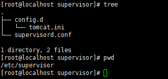
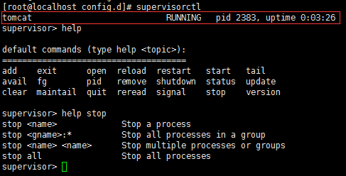
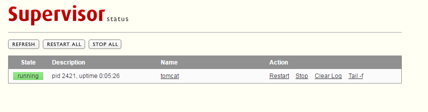

# supervisord守护进程的使用

原文链接：[http://blog.csdn.net/xyang81/article/details/51555473](http://blog.csdn.net/xyang81/article/details/51555473)

Supervisor（[http://supervisord.org/](http://supervisord.org)）是用Python开发的一个client/server服务，是Linux/Unix系统下的一个进程管理工具，不支持Windows系统。它可以很方便的监听、启动、停止、重启一个或多个进程。用Supervisor管理的进程，当一个进程意外被杀死，supervisort监听到进程死后，会自动将它重新拉起，很方便的做到进程自动恢复的功能，不再需要自己写shell脚本来控制。

因为Supervisor是Python开发的，安装前先检查一下系统否安装了Python2.4以上版本。下面以CentOS7，Python2.7版本环境下，介绍Supervisor的安装与配置步聚：

1、安装Python包管理工具（easy\_install）： easy\_install是setuptools包里带的一个命令，使用easy\_install实际上是在调用setuptools来完成安装模块的工作,所以安装setuptools即可。&#x20;

`wget --no-check-certificate https://bootstrap.pypa.io/ez_setup.py -O - | sudo python`

2、安装supervisor `easy_install supervisor`  `supervisor`安装完成后会生成三个执行程序：`supervisortd`、`supervisorctl`、`echo_supervisord_conf`，分别是`supervisor`的守护进程服务（用于接收进程管理命令）、客户端（用于和守护进程通信，发送管理进程的指令）、生成初始配置文件程序。

3、配置 运行supervisord服务的时候，需要指定supervisor配置文件，如果没有显示指定，默认在以下目录查找：

`$CWD/supervisord.conf`  \
`$CWD/etc/supervisord.conf` \
`/etc/supervisord.conf` \
`/etc/supervisor/supervisord.conf (since Supervisor 3.3.0) ../etc/supervisord.conf (Relative to the executable) ../supervisord.conf (Relative to the executable)`

&#x20;$CWD表示运行supervisord程序的目录。

可以通过运行echo\_supervisord\_conf程序生成supervisor的初始化配置文件，如下所示：

`mkdir /etc/supervisor echo_supervisord_conf > /etc/supervisor/supervisord.com`

配置文件参数说明 supervisor的配置参数较多，下面介绍一下常用的参数配置，详细的配置及说明，请参考官方文档介绍。&#x20;

注：分号（;）开头的配置表示注释

`[unix_http_server] file=/tmp/supervisor.sock ;UNIX socket 文件，supervisorctl 会使用` \
`;chmod=0700 ;socket文件的mode，默认是0700` \
`;chown=nobody:nogroup ;socket文件的owner，格式：uid:gid`\
``\
`;[inet_http_server] ;HTTP服务器，提供web管理界面` \
`;port=127.0.0.1:9001 ;Web管理后台运行的IP和端口，如果开放到公网，需要注意安全性` \
`;username=user ;登录管理后台的用户名` \
`;password=123 ;登录管理后台的密码`\
``\
`[supervisord]` \
`logfile=/tmp/supervisord.log ;日志文件，默认是 $CWD/supervisord.log` \
`logfile_maxbytes=50MB ;日志文件大小，超出会rotate，默认 50MB，如果设成0，表示不限制大小` \
`logfile_backups=10 ;日志文件保留备份数量默认10，设为0表示不备份` \
`loglevel=info ;日志级别，默认info，其它: debug,warn,trace` \
`pidfile=/tmp/supervisord.pid ;pid 文件` \
`nodaemon=false ;是否在前台启动，默认是false，即以 daemon 的方式启动` \
`minfds=1024 ;可以打开的文件描述符的最小值，默认 1024` \
`minprocs=200 ;可以打开的进程数的最小值，默认 200`\
``\
`[supervisorctl]` \
`serverurl=unix:///tmp/supervisor.sock ;通过UNIX socket连接supervisord，路径与unix_http_server部分的file一致` \
`;serverurl=http://127.0.0.1:9001; 通过HTTP的方式连接supervisord`\
``\
`; [program:xx]是被管理的进程配置参数，xx是进程的名称` \
`[program:xx]` \
`command=/opt/apache-tomcat-8.0.35/bin/catalina.sh run ; 程序启动命令` \
`autostart=true ; 在supervisord启动的时候也自动启动` \
`startsecs=10 ; 启动10秒后没有异常退出，就表示进程正常启动了，默认为1秒` \
`autorestart=true ; 程序退出后自动重启,可选值：[unexpected,true,false]，默认为unexpected，表示进程意外杀死后才重启` \
`startretries=3 ; 启动失败自动重试次数，默认是3` \
`user=tomcat ; 用哪个用户启动进程，默认是root` \
`priority=999 ; 进程启动优先级，默认999，值小的优先启动` \
`redirect_stderr=true ; 把stderr重定向到stdout，默认false stdout_logfile_maxbytes=20MB ; stdout 日志文件大小，默认50MB stdout_logfile_backups = 20 ; stdout 日志文件备份数，默认是10` \
``\
`; stdout 日志文件，需要注意当指定目录不存在时无法正常启动，所以需要手动创建目录（supervisord 会自动创建日志文件）` \
`stdout_logfile=/opt/apache-tomcat-8.0.35/logs/catalina.out` \
`stopasgroup=false ;默认为false,进程被杀死时，是否向这个进程组发送stop信号，包括子进程 killasgroup=false ;默认为false，向进程组发送kill信号，包括子进程`\
``\
`;包含其它配置文件` \
`[include]` \
`files = relative/directory/*.ini ;可以指定一个或多个以.ini结束的配置文件`&#x20;

&#x20;include示例：

`[include]` \
`files = /opt/absolute/filename.ini /opt/absolute/*.ini foo.conf config??.ini`

配置管理进程 进程管理配置参数，不建议全都写在supervisord.conf文件中，应该每个进程写一个配置文件放在include指定的目录下包含进supervisord.conf文件中。 1> 创建/etc/supervisor/config.d目录，用于存放进程管理的配置文件 2> 修改/etc/supervisor/supervisord.conf中的include参数，将/etc/supervisor/conf.d目录添加到include中

`[include]` \
`files = /etc/supervisor/config.d/*.ini`

下面是配置Tomcat进程的一个例子：

`[program:tomcat]` \
`command=/opt/apache-tomcat-8.0.35/bin/catalina.sh run stdout_logfile=/opt/apache-tomcat-8.0.35/logs/catalina.out` \
`autostart=true` \
`autorestart=true` \
`startsecs=5`\
`priority=1` \
`stopasgroup=true` \
`killasgroup=true`

启动Supervisor服务&#x20;

`supervisord -c /etc/supervisor/supervisord.conf`

6、控制进程&#x20;

6.1 交互终端&#x20;

`supervisord`启动成功后，可以通过`supervisorctl`客户端控制进程，启动、停止、重启。运行`supervisorctl`命令，不加参数，会进入supervisor客户端的交互终端，并会列出当前所管理的所有进程。 &#x20;

上图中的tomcat就是我们在配置文件中\[program:tomcat]指定的名字。

&#x20;输入`help`可以查看可以执行的命令列表，如果想看某个命令的作用，运行help 命令名称，如：`help stop`

`stop tomcat // 表示停止tomcat进程`\
`stop all // 表示停止所有进程`\
`// ...`&#x20;

6.2 bash终端

`supervisorctl status`\
`supervisorctl stop tomcat` \
`supervisorctl start tomcat` \
`supervisorctl restart tomcat` \
`supervisorctl reread` \
`supervisorctl update`

&#x20;Web管理界面

出于安全考虑，默认配置是没有开启web管理界面，需要修改supervisord.conf配置文件打开http访权限，将下面的配置：

`;[inet_http_server] ; inet (TCP) server disabled by default` \
`;port=127.0.0.1:9001 ; (ip_address:port specifier, *:port for all iface)` \
`;username=user ; (default is no username (open server))` \
`;password=123 ; (default is no password (open server))`&#x20;

修改成：

`[inet_http_server] ; inet (TCP) server disabled by default` \
`port=0.0.0.0:9001 ; (ip_address:port specifier, *:port for all iface)` \
`username=user ; (default is no username (open server))` \
`password=123 ; (default is no password (open server))`

port：绑定访问IP和端口，这里是绑定的是本地IP和9001端口 \
username：登录管理后台的用户名\
password：登录管理后台的密码

7、开机启动Supervisor服务&#x20;

7.1 配置systemctl服务&#x20;

1> 进入/lib/systemd/system目录，并创建supervisor.service文件

`[Unit]` \
`Description=supervisor` \
`After=network.target`\
``\
`[Service]` \
`Type=forking` \
`ExecStart=/usr/bin/supervisord -c /etc/supervisor/supervisord.conf` \
`ExecStop=/usr/bin/supervisorctl $OPTIONS shutdown` \
`ExecReload=/usr/bin/supervisorctl $OPTIONS reload` \
`KillMode=process` \
`Restart=on-failure` \
`RestartSec=42s`\
``\
`[Install]` \
`WantedBy=multi-user.target`

&#x20;2> 设置开机启动

`systemctl enable supervisor.service` \
`systemctl daemon-reload`&#x20;

3、修改文件权限为766

`chmod 766 supervisor.service`

7.2 配置service类型服务

`#!/bin/bash`\
`#`\
`#supervisord   This scripts turns supervisord on`\
`#Author:       Mike McGrath mmcgrath@redhat.com (based off yumupdatesd)`\
`#chkconfig:    - 95 04`\
`#description:  supervisor is a process control utility.  It has a web based`\
`#xmlrpc interface as well as a few other nifty features.`\
`#processname:  supervisord`\
`#config: /etc/supervisor/supervisord.conf`\
`#pidfile: /var/run/supervisord.pid`\
`#source function library`\
``\
`. /etc/rc.d/init.d/functions`\
``\
`RETVAL=0`\
``\
`start() {` \
&#x20;   `echo -n $"Starting supervisord: "`\
&#x20;   `daemon "supervisord -c /etc/supervisor/supervisord.conf "` \
&#x20;   `RETVAL=$?` \
&#x20;   `echo [ $RETVAL -eq 0 ] && touch /var/lock/subsys/supervisord` \
`}`\
``\
`stop() {`\
&#x20;   `echo -n $"Stopping supervisord: "` \
&#x20;   `killproc supervisord` \
&#x20;   `echo [ $RETVAL -eq 0 ] && rm -f /var/lock/subsys/supervisord` \
`}`\
``\
`restart() {`\
&#x20;   `stop`\
&#x20;   `start` \
`}`\
``\
`case "$1" in` \
&#x20;   `start)`\
&#x20;     `start` \
&#x20;     `;;`\
&#x20;   `stop)` \
&#x20;     `stop` \
&#x20;     `;;` \
&#x20;   `restart|force-reload|reload)`\
&#x20;     `restart`\
&#x20;     `;;`\
&#x20;   `condrestart)`\
&#x20;     `[ -f /var/lock/subsys/supervisord ] && restart`\
&#x20;     `;;`\
&#x20;   `status)`\
&#x20;     `status supervisord`\
&#x20;     `RETVAL=$?`\
&#x20;     `;;`\
&#x20;   `*)`\
&#x20;     `echo $"Usage: $0 {start|stop|status|restart|reload|force-reload|condrestart}"`\
&#x20;     `exit 1 esac`\
``\
`exit $RETVAL`&#x20;

将上述脚本内容保存到/etc/rc.d/init.d/supervisor文件中，修改文件权限为755，并设置开机启动

`chmod 755 /etc/rc.d/init.d/supervisor` \
`chkconfig supervisor on`&#x20;

注意：修改脚本中supervisor配置文件路径为你的supervisor的配置文件路径

其它Linux发行版开机启动脚本：[https://github.com/Supervisor/initscripts](https://github.com/Supervisor/initscripts)

注意： Supervisor只能管理非daemon的进程，也就是说Supervisor不能管理守护进程。否则提示Exited too quickly (process log may have details)异常。例子中的Tomcat默认是以守护进程启动的，所以我们改成了catalina.sh run，以前台进程的方式运行。

yum方式安装

`yum install epel-release` \
`yum install -y supervisor`&#x20;

supervisor没有发布在标准的CentOS源在，需要安装epel源。这种方式安装的可能不是最新版本，但比较方便，安装完成之后，配置文件会自动帮你生成。 默认配置文件：/etc/supervisord.conf 进程管理配置文件放到：/etc/supervisord.d/目录下即可

默认日志文件：/tmp/supervisord.log，可以查看进程的启动信息&#x20;
